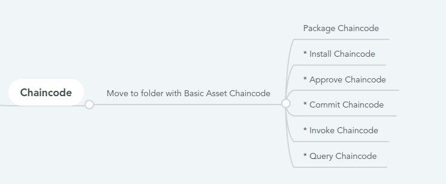

#   Chaincode Lifecycle And Operations

- Once the setup is us and running, you bash into the cli container and execute the commands for chaincode related operations.

- Below are the chaincode related operations to be performed:


```
* Package Chaincode
* Install Chaincode
* Approve Chaincode 
* Commit Chaincode 
* Invoke Chaincode
* Query Chaincode
```

- The chaincode we are going to use is developed using GO, so all the above processes will be executed from Go chaincode perspective.




##   Package Chaincode

- First of all we need to resolve the dependencies of the chaincode before packaging it. As for the new lifecycle flow the chaincode dependecies are managed using go mod, we need to navigate to the projects base folder and run the below command to install all the chaincode dependencies.

`GO111MODULE=on go mod vendor
`

- Steps for installing the chaincode will vary for other language chaincode like javascript,typescript.

- Now you can package the chaincode by running the below peer command.

`$FABRIC_EXECUTABLE_PATH lifecycle package basic golang <rootDir>//Hyperledger-Fabric-On-AKS/chaincode-samples/asset-transfer-basic/chaincode-go`

> NoteL Fabric cli should be initialized and channel should be created

## Install Chaincode

- Once the packaging of the smart contract is done, we need to install the smart contract on the peers of the organization.


`  $FABRIC_EXECUTABLE_PATH lifecycle install basic ./basic.tgz
`

- The chaincode image is build by the peer when the chaincode is installed.If the build fails the command will return the error for that else if the chaincode gets successfully installed onto the peer it will return the package identifier for the installed chaincode which will get printed in the logs like below.

```
2020-07-16 10:09:57.534 CDT [cli.lifecycle.chaincode] submitInstallProposal -> INFO 001 Installed remotely: response:<status:200 	payload:"\nJbasic_1.0:e2db7f693d4aa6156e652741d5606e9c5f0de9ebb88c5721cb8248c3aead8123\022\tbasic_1.0" >
2020-07-16 10:09:57.534 CDT [cli.lifecycle.chaincode] submitInstallProposal -> INFO 002 Chaincode code package identifier: basic_1.0:e2db7f693d4aa6156e652741d5606e9c5f0de9ebb88c5721cb8248c3aead8123
```


- This package id will be used in the approve and commit process of the chaincode.


##  Approve Chaincode

- After installation of the chaincode, it needs to be approved by the organizations based on the defined lifecycle endorsement policy. To approve the chaincode for the organization execute the below command.

```
$FABRIC_EXECUTABLE_PATH lifecycle approve basic v1 basic:574f3c42bbb334ea03aa337ebab39ccc601874ac0ff376bb69e56f79be777080 1 --policy "OR('<peerorg>.member')"
```


## Commit Chaincode

- Use below command to commit the chaincode onto the channel.

```
$FABRIC_EXECUTABLE_PATH lifecycle commit basic v1 1 --policy "OR('<peerorg>.member')"

```


- Once the commit succeeds the information is written onto the channel and chaincode is ready to be used for invoke and query calls. 

## Invoke Chaincode

- Once the chaincode is committed we can execute the invoke command to perform action on a channel using that chaincode. Below is a sample invoke command.

```
$FABRIC_EXECUTABLE_PATH  chaincode invoke basic --fcn InitLedger --args []
```

- Invoke command will write the transaction onto the channel with the values passed in the arguments as per the chaincode logic.

## Query Chaincode


- You can query the chaincode to get the updated values from the chaincodes. Below is a sample command for that.

```

$FABRIC_EXECUTABLE_PATH  chaincode query basic --fcn GetAllAssets  --args []
```


# Important
- Note: Due to the recent update in Kubernetes for underneath runtime environment from docker to "containerd", the chaincode containers will not be functional, customers will have to move to running external chaincode as a service which is possible on HLF 2.2x only.


## Follow Up
- Enable external chaincode and run it as a container.
- [External Chaincode Operations](ExternalChaincode.md)