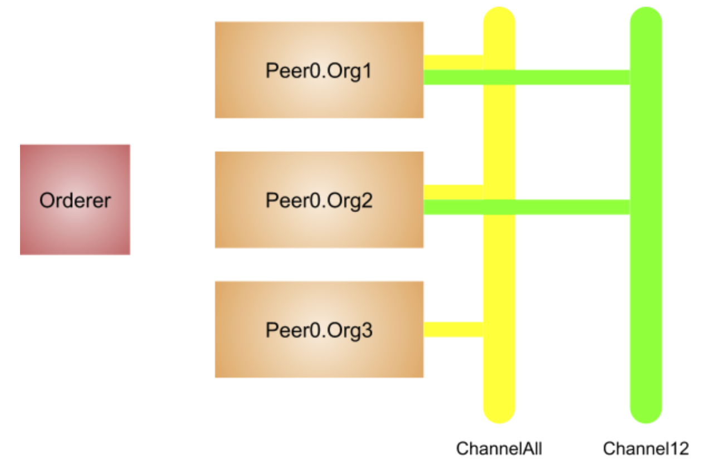

# Channel Operations




- Use the following command to pull binaries of HLF 2.2

- Using the fabric binaries OrgName is collected to replace peerOrgName in configtx. Once this step completes configtxgen is used to to create channel context.
- Peers join the network using join channel.
```
cd setupFabricCli
  
curl https://raw.githubusercontent.com/hyperledger/fabric/master/scripts/bootstrap.sh | bash -s -- 2.2.0 -d -s

cat tempConfigtx.yaml | sed -e "s/OrgName/<peerOrgName>/g" > configtx.yaml
  
bin/configtxgen -profile OrgsChannel -outputCreateChannelTx ./channel-artifacts/<channel-name>.tx -channelID <channel-name>
$FABRIC_EXECUTABLE_PATH channel create <channel-name> ./channel-artifacts/<channel-name>.tx
$FABRIC_EXECUTABLE_PATH channel join <channel-name>

```


- Package chaincode

`$FABRIC_EXECUTABLE_PATH lifecycle package <chaincode-label> <chaincode-type> <path>`


- Install chaincode

`$FABRIC_EXECUTABLE_PATH lifecycle install <chaincode-label> <path>
`

- Approve chaincode

`$FABRIC_EXECUTABLE_PATH lifecycle approve <chaincode-name> <version> <package-id> <sequence> --policy <policy string>`


- Commit chaincode

`$FABRIC_EXECUTABLE_PATH lifecycle commit <chaincode-name> <version> <sequence> --policy <policy>`

- Invoke chaincode

`$FABRIC_EXECUTABLE_PATH  chaincode invoke -h
`
- Query chaincode

`$FABRIC_EXECUTABLE_PATH chaincode query -h
`

### Create Channel With Custom Policy

- New channel with custom policy can be created by editing the policy in the "tempConfigtx.yaml" and then executing the commands in the "Channel Operation" section to create a new channel with those custom policies.

- For example, let's assume for Application Admin policy we want to change the permissions where in place of Majority only "orgName" organization's admin signatures are required to approve the changes. In that case our application section in the yaml file will look like as below.


```
 Application: &ApplicationDefaults
 
     # Organizations is the list of orgs which are defined as participants on
     # the application side of the network
     Organizations:
 
     # Policies defines the set of policies at this level of the config tree
     # For Application policies, their canonical path is
     #   /Channel/Application/<PolicyName>
     Policies:
         Readers:
             Type: ImplicitMeta
             Rule: "ANY Readers"
         Writers:
             Type: ImplicitMeta
             Rule: "ANY Writers"
         Admins:
             Type: Signature
             Rule: "OR('OrgName.admin')"
         # LifecycleEndorsement:
         #     Type: ImplicitMeta
         #     Rule: "MAJORITY Endorsement"
         # Endorsement:
         #     Type: ImplicitMeta
         #     Rule: "MAJORITY Endorsement"
 
     Capabilities:
         <<: *ApplicationCapabilities

```

- After making this change you generate the genesis and channel files using commands as in the "Channel Operation" section and you will get a channel with custom policy of you own.


## Follow Up
- Continue deployment by performing chaincode interactions.
- [Chaincode Operations](ChaincodeOperations.md)