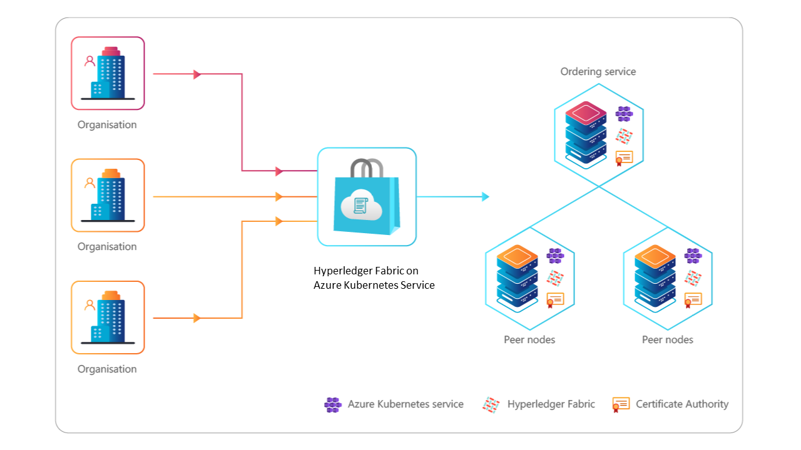

# Consortium Creation




```
cd Hyperledger-Fabric-On-AKS/azhlfTool 
npm install
npm run setup
```

- Set up environment variables Set environment variables for the orderer organization's client


```
ORDERER_ORG_SUBSCRIPTION=<ordererOrgSubscription>
ORDERER_ORG_RESOURCE_GROUP=<ordererOrgResourceGroup>
ORDERER_ORG_NAME=<ordererOrgName>
ORDERER_ADMIN_IDENTITY="admin.$ORDERER_ORG_NAME"
CHANNEL_NAME=<channelName>
```

- Set environment variables for the peer organization's client


```
PEER_ORG_SUBSCRIPTION=<peerOrgSubscritpion>
PEER_ORG_RESOURCE_GROUP=<peerOrgResourceGroup>
PEER_ORG_NAME=<peerOrgName>
PEER_ADMIN_IDENTITY="admin.$PEER_ORG_NAME"
CHANNEL_NAME=<channelName>
```
- Set environment variables for an Azure storage account


```
STORAGE_SUBSCRIPTION=<subscriptionId>
STORAGE_RESOURCE_GROUP=<azureFileShareResourceGroup>
STORAGE_ACCOUNT=<azureStorageAccountName>
STORAGE_LOCATION=<azureStorageAccountLocation>
STORAGE_FILE_SHARE=<azureFileShareName>
```

> Use the following commands to create an Azure storage account. If you already have Azure storage account, skip this step.


```
az account set --subscription $STORAGE_SUBSCRIPTION
az group create -l $STORAGE_LOCATION -n $STORAGE_RESOURCE_GROUP
az storage account create -n $STORAGE_ACCOUNT -g  $STORAGE_RESOURCE_GROUP -l $STORAGE_LOCATION --sku Standard_LRS
```

- Use the following commands to create a file share in the Azure storage account. If you already have a file share, skip this step.


```
STORAGE_KEY=$(az storage account keys list --resource-group $STORAGE_RESOURCE_GROUP  --account-name $STORAGE_ACCOUNT --query "[0].value" | tr -d '"')
az storage share create  --account-name $STORAGE_ACCOUNT  --account-key $STORAGE_KEY  --name $STORAGE_FILE_SHARE
```

- Use the following commands to generate a connection string for an Azure file share.


```
STORAGE_KEY=$(az storage account keys list --resource-group $STORAGE_RESOURCE_GROUP  --account-name $STORAGE_ACCOUNT --query "[0].value" | tr -d '"')
SAS_TOKEN=$(az storage account generate-sas --account-key $STORAGE_KEY --account-name $STORAGE_ACCOUNT --expiry `date -u -d "1 day" '+%Y-%m-%dT%H:%MZ'` --https-only --permissions lruwd --resource-types sco --services f | tr -d '"')
AZURE_FILE_CONNECTION_STRING=https://$STORAGE_ACCOUNT.file.core.windows.net/$STORAGE_FILE_SHARE?$SAS_TOKEN

```

### Import an organization connection profile, admin user identity, and MSP

- Use the following commands to fetch the organization's connection profile, admin user identity, and Managed Service Provider (MSP) from the Azure Kubernetes Service cluster and store these identities in the client application's local store. An example of a local store is the azhlfTool/stores directory.

- For the orderer organization:


```
./azhlf adminProfile import fromAzure -o $ORDERER_ORG_NAME -g $ORDERER_ORG_RESOURCE_GROUP -s $ORDERER_ORG_SUBSCRIPTION
./azhlf connectionProfile import fromAzure -g $ORDERER_ORG_RESOURCE_GROUP -s $ORDERER_ORG_SUBSCRIPTION -o $ORDERER_ORG_NAME   
./azhlf msp import fromAzure -g $ORDERER_ORG_RESOURCE_GROUP -s $ORDERER_ORG_SUBSCRIPTION -o $ORDERER_ORG_NAME
```


- For the peer organization:


```
./azhlf adminProfile import fromAzure -g $PEER_ORG_RESOURCE_GROUP -s $PEER_ORG_SUBSCRIPTION -o $PEER_ORG_NAME
./azhlf connectionProfile import fromAzure -g $PEER_ORG_RESOURCE_GROUP -s $PEER_ORG_SUBSCRIPTION -o $PEER_ORG_NAME
./azhlf msp import fromAzure -g $PEER_ORG_RESOURCE_GROUP -s $PEER_ORG_SUBSCRIPTION -o $PEER_ORG_NAME
```

### Add a peer organization for consortium management
- Run the following commands in the given order to add a peer organization in a channel and consortium:

- From the peer organization's client, upload the peer organization's MSP on Azure Storage.


```
./azhlf msp export toAzureStorage -f  $AZURE_FILE_CONNECTION_STRING -o $PEER_ORG_NAME
```

- From the orderer organization's client, download the peer organization's MSP from Azure Storage. Then issue the command to add the peer organization in the channel and consortium.


```
./azhlf msp import fromAzureStorage -o $PEER_ORG_NAME -f $AZURE_FILE_CONNECTION_STRING
./azhlf consortium join -o $ORDERER_ORG_NAME  -u $ORDERER_ADMIN_IDENTITY -p $PEER_ORG_NAME
```
  
## Follow Up
- Continue deployment by creating a command line interface.
- [Fabric Go Cli](FabricGoCli.md)