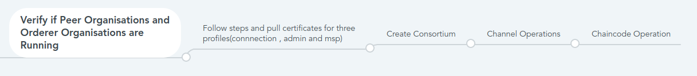

# Deploying the template 🛠

- The template can be deployed using Azure CLI or Powershell.

- Sample command to deploy from Azure CLI is as follows:
- `az deployment group create --name <deployment> --resource-group <resourceGroup> --subscription <subscriptionId> --template-uri https://<baseURI>/mainTemplate.json`

## Next Steps

-Once Peer and Orderer are deployed

# Running native HLF operations

- Sample application for performing the HLF operations. The commands are provided to Create new user identity and install your own chaincode.

## Generate connection profile and admin profile

- Create profile directory inside the app folder
- cd application
- 
- mkdir ./profile

- Set these environment variables on Azure cloud shell

- `ORGNAME=<orgname>`
- `AKS_RESOURCE_GROUP=<resourceGroup>`

- Execute below comand to generate connection profile and admin profile of the organization
#
- `./getConnector.sh $AKS_RESOURCE_GROUP | sed -e "s/{action}/gateway/g"| xargs curl > ./profile/$ORGNAME-ccp.json`

- `./getConnector.sh $AKS_RESOURCE_GROUP | sed -e "s/{action}/admin/g"| xargs curl > ./profile/$ORGNAME-admin.json`

- `./getConnector.sh $AKS_RESOURCE_GROUP | sed -e "s/{action}/msp/g"| xargs curl > ./profile/$ORGNAME-msp.json`

It will create connection profile,admin profile and msp profile of the organization inside the profile folder with name <orgname>-ccp.json and <orgname>-admin.json respectively.

- Similarly, generate connection profile, admin profile and msp profile for each orderer and peer organization.
  
  
  ## Follow up
   -  Continue deployment by creating consortiums.
   -  [Create Consortium](CreatingConsortiums.md)
