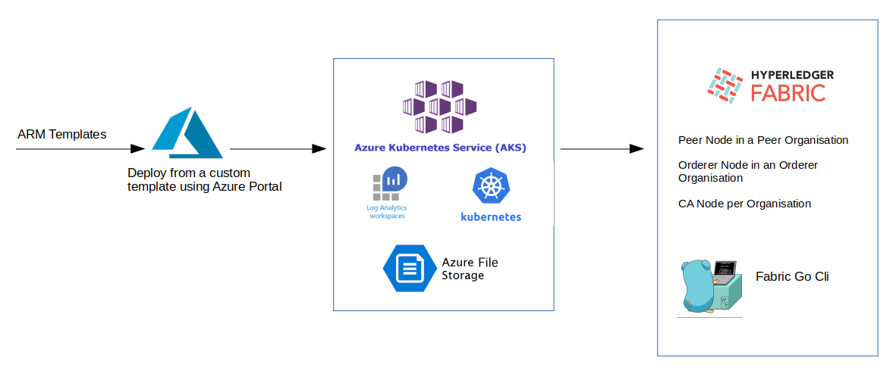

# Infrastructure Deployment

This page describes the steps needed to deploy the infrastructure without the Marketplace offering route.

## Requirements

The following requirements need to be met:

* Subscriptions with HLF preview enabled
* CA Certificates for HLF
* Storage Account created and with a container

## Manual deployment





- Hyperledger Fabric 2.2 network which is made up of a Peer Cluster and an Orderer Cluster that gets deployed separately and gets connected post deployment facilitated with IaaS model using Microsoft ARM template.

- This application is based on Azure Blockchain as a Service using ARM code which is available as opensource for HL 1.4 on Github.


## Services and Deployments 🛠

```
    Peer Node in a Peer Organisation
    Orderer Node in an Orderer Organisation
    CA Node per Organisation
    Fabric Go Cli 
    Log Analytics on Azure
    Container Insights on Azure
    Storage Account for Azure
```

## Generating the docker image and the marketplace artifacts 🛠
### Clone the git repo

`git clone https://github.com/krypc-code/Hyperledger-Fabric-on-Azure-Kubernetes-Cluster.git`

### Navigate to the scripts directory

`cd Hyperledger-Fabric-on-Azure-Kubernetes-Cluster/scripts`


### Execute the generateArtifacts.sh script

`bash generateArtifacts.sh <DockerImageNameWithTag>`

- An example to this command would be

- `bash generateArtifacts.sh yourrepo/fabrictools:3.1`


## Push the image to the registry 🛠

- The image that is built in the previous step needs to be uploaded in a docker registry to be used by the ARM template.

- The image can be pushed to a docker registry of your choice by using the following command:
- `docker push <DockerImageWithTag>`
- Please note that you may need to do docker login to your registry to successfully push the image.


## Upload the generated artifacts 🛠
- The artifacts are generated at `Hyperledger-Fabric-On-AKS/out`. The contents in the `out` directory should be uploaded to a location that can be accessed by the template. While uploading, the directory structure should not be changed.

For example, if we are uploading the artifacts to the Azure Blob using Azure CLI, the following commands can be used.

- First,create storage account, get account keys and create a container named `mktplace` inside it.
```
az storage blob upload --account-name <storageAccountName> --container-name mktplace --file <rootDir>/Hyperledger-Fabric-on-Azure-Kubernetes-Cluster/out/hlf-marketplace.zip --name hlf-marketplace.zip --account-key $ACCOUNT_KEY

az storage blob upload --account-name <storageAccountName> --container-name mktplace --file <rootDir>/Hyperledger-Fabric-on-Azure-Kubernetes-Cluster/out/artifacts/funcNodeJS.zip --name artifacts/funcNodeJS.zip --account-key $ACCOUNT_KEY

az storage blob upload --account-name <storageAccountName> --container-name mktplace --file <rootDir>/Hyperledger-Fabric-on-Azure-Kubernetes-Cluster/out/nestedtemplates/publicIpTemplate.json --name nestedtemplates/publicIpTemplate.json --account-key $ACCOUNT_KEY

az storage blob upload --account-name <storageAccountName> --container-name mktplace --file <rootDir>/Hyperledger-Fabric-on-Azure-Kubernetes-Cluster/out/mainTemplate.json --name mainTemplate.json --account-key $ACCOUNT_KEY

```

## Create Connection Profiles
  - Continue the deployment by creating connection profiles.
 - [Profiles](CreatingProfiles.md)
